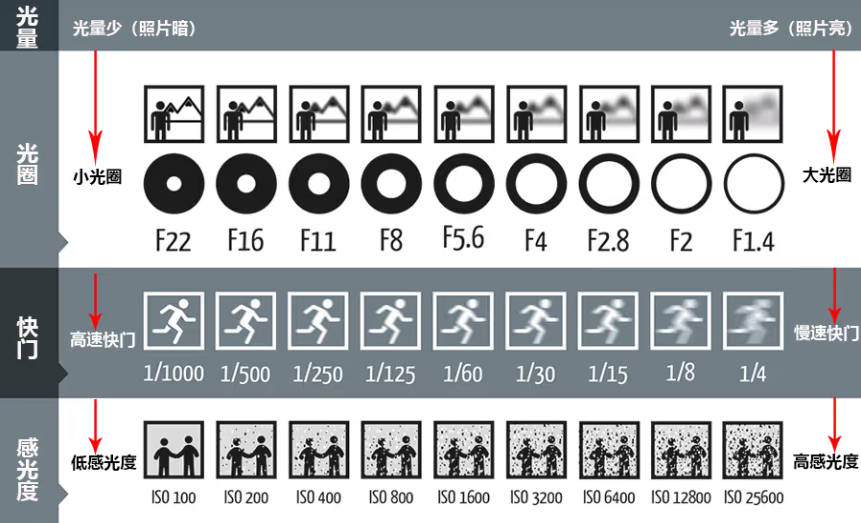
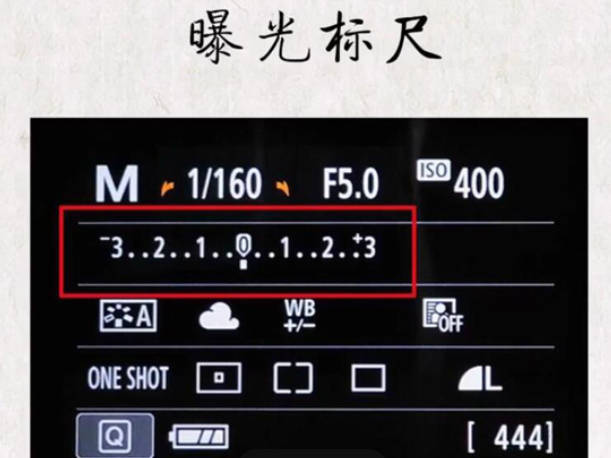

目录

[1、曝光三要素](#1、曝光三要素)

[2、相机档位介绍](#2、相机档位介绍)

[3、对焦及对焦区域](#3、对焦及对焦区域)

[4、景深](#4、景深)

[5、色温](#5、色温)

[6、白平衡](#6、白平衡)

[7、测光](#7、测光)

[8、曝光补偿](#8、曝光补偿)

[9、补光灯及闪光灯](#9、补光灯及闪光灯)

# **1、曝光三要素**

-   光圈（f）

1、光圈越大，屏幕上显示的光圈数值越小，背景越虚化，同时进光量也越大；同理，光圈越小，屏幕上现实的光圈数值越大，背景越清晰，进而进光量也越少。

2、当位于大光圈时，或者其他状态时，尽量不要对着太阳拍摄，会极大程度的损坏相机的cmos，因为大光圈就相当于放大镜。

-   快门（s）

1、快门就是拍照的一瞬间听到的声音（咔嚓）响的时长；

2、快门数值越大，听到的响声（咔嚓）持续的时间就越长，进光量就越大；同理，快门数值越小，听到的响声（咔嚓）持续的时间就越短，进光量就越少。

3、快门数值越大拍摄的物体越模糊（有三脚架除外），数值越小，拍摄物体时不容易模糊；快门数值的大小不同有不同的应用场景，①快门数值越大可以拍摄星空，延时摄影等场景；②快门数值越小，比较适合拍摄运动的物体，抓拍，静止的物体。

4、注意：快门数值越大虽然可以提高进光量，但是画面容易糊，因为人在手持相机的情况下没有那么稳定，因此，在没有三脚架的情况下不建议将快门的数字增加到1/125s以上。

-   感光度（iso）

1、感光度可以直接控制整张照片的明暗程度，但是缺点也是很明显的，感光度数值越大，照片上的噪点越多，就比较模糊；同理，感光度数值越小，噪点就越少，照片比较清晰，画质就越好。

一张照片是否正常曝光由这三点共同决定！！！

# **2、相机档位介绍**

**以尼康相机为例，这里主要介绍五个档位：AUTO档、A档、S档、P档、M档**

## **AUTO档（自动档）**

>   俗称傻瓜模式，不同调节任何参数，也调解不了参数，拿起来拍就行了（不如用手机）。

## A档（光圈优先档）

>   ：什么是光圈优先？
>
>   ：半自动档位，用户只能调节光圈的大小，另外两个参数快门和感光度由相机根据实时环境自动调节。

>   如何调节请看[曝光三要素](#1、曝光三要素)

## S档（快门优先档，部分相机称为TV档）

>   ：什么是快门优先？
>
>   ：半自动档位，用户只能调节快门数值，另外两个参数光圈和感光度由相机根据实时环境自动调节。

>   如何调节请看[曝光三要素](#1、曝光三要素)

## P档（程序自动档）

>   ：什么程序自动？
>
>   ：半自动档位，用户只能调节感光度数值，另外两个参数光圈和快门由相机根据实时环境自动调节。

>   如何调节请看[曝光三要素](#1、曝光三要素)

## M档（手动档）

>   顾名思义，曝光三要素的三个参数均由用户控制，相机不会干涉。
>
>   可以通过观察曝光标尺的位置来确定曝光是否正常。
>
>   在M档（全手动档）下：建议调整顺序为：光圈>快门>感光度。这样做的目的是保证最好的画质！！

>   如何调节请看[曝光三要素](#1、曝光三要素)

# **3、对焦及对焦区域**

# **4、景深**

# **5、色温**

# **6、白平衡**

# **7、测光**

# **8、曝光补偿**

# **9、补光灯及闪光灯**
